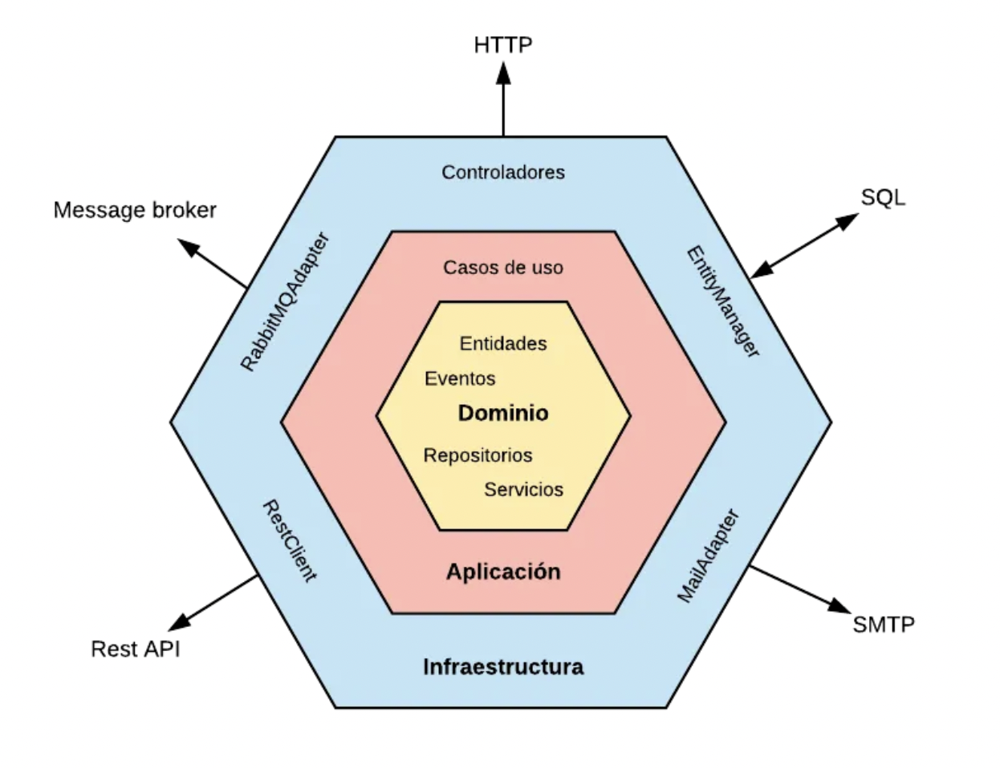
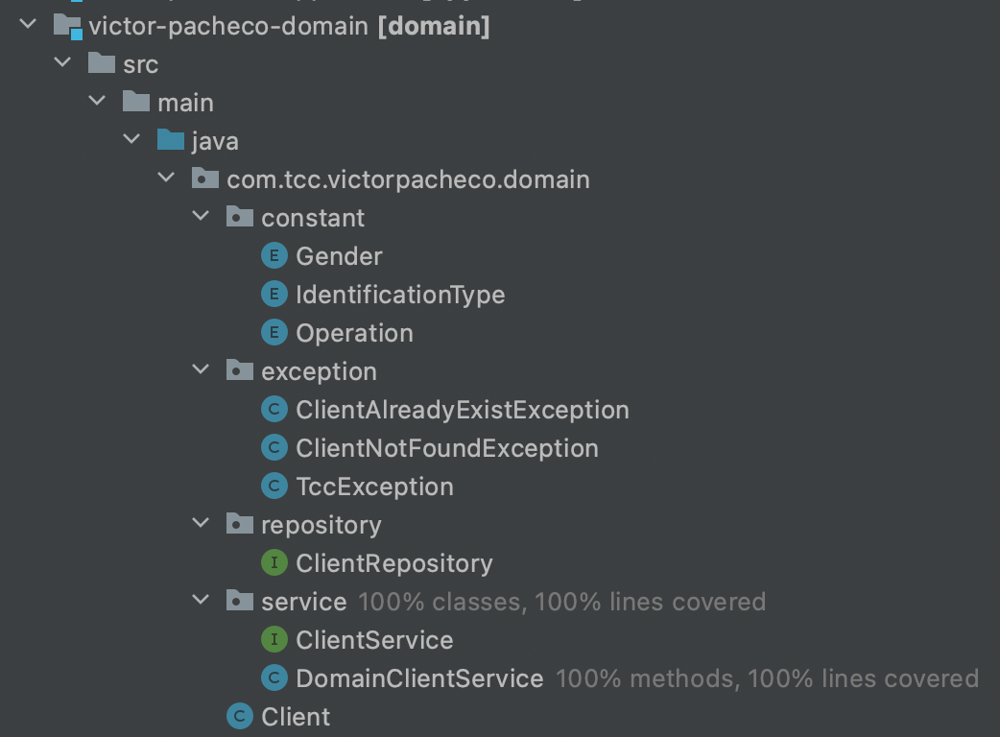
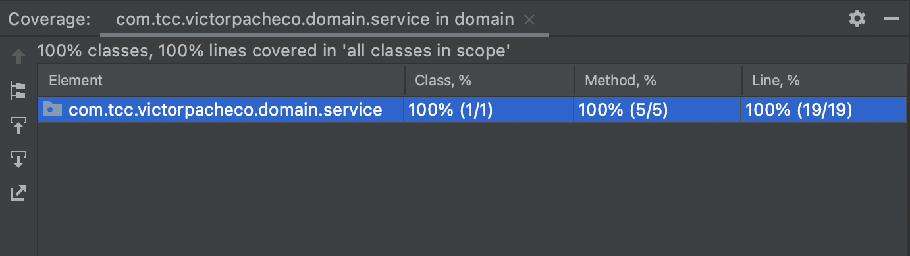
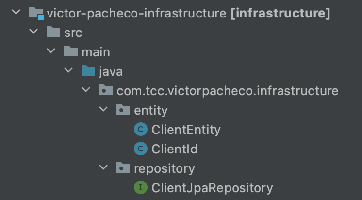
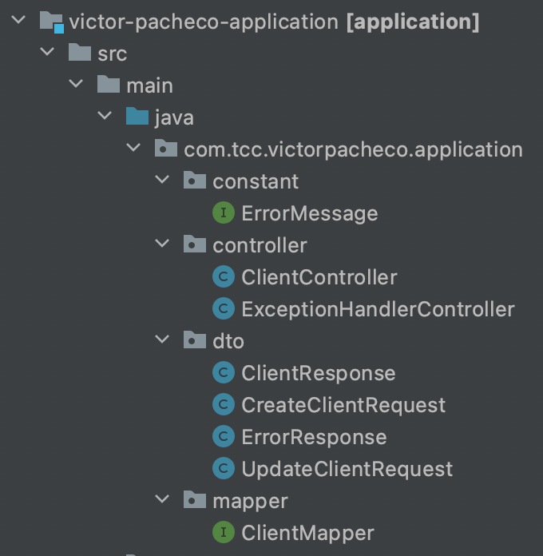
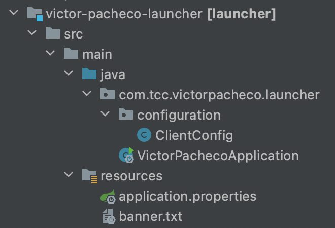
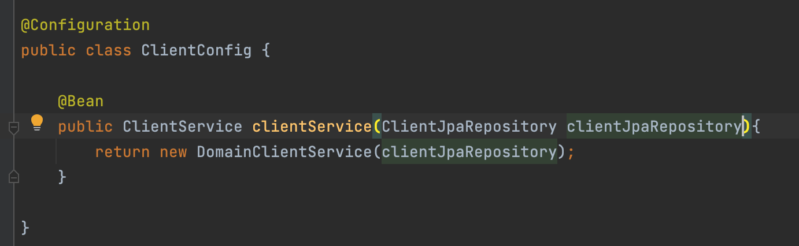
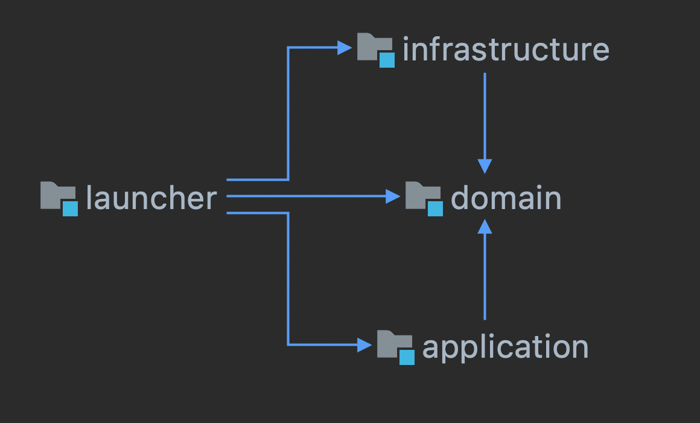

# Repositorio Prueba Técnica Victor Pacheco

## Backend

### Introducción a la Arquitectura Hexagonal

#### Intención
El propósito de la Arquitectura Hexagonal es garantizar que una aplicación pueda ser utilizada de manera uniforme por diferentes usuarios, programas, pruebas automatizadas o scripts. Además, busca que la aplicación pueda ser desarrollada y probada de manera independiente de los dispositivos y bases de datos que eventualmente estén involucrados durante la ejecución. En resumen, se busca la capacidad de utilizar, desarrollar y probar la aplicación de manera aislada de los componentes externos en tiempo de ejecución.

#### Motivación
Una de las principales dificultades en las aplicaciones de software ha sido la mezcla de la lógica del negocio con el código de la interfaz de usuario. Esta situación genera numerosos problemas:
- Complica la posibilidad de realizar pruebas automatizadas.
- Limita la flexibilidad para modificar o adaptar la aplicación.
- Dificulta o incluso impide la integración con otros programas. 
  
Otra importante dificultad es la dependencia directa con detalles específicos de la infraestructura, como por ejemplo la base de datos.
  
#### La solución
La Arquitectura Hexagonal, propuesta por [Alistair Cockburn](https://alistair.cockburn.us/) y conocida también como arquitectura de puertos y adaptadores, busca la separación de una aplicación en capas o regiones con responsabilidades específicas. Este enfoque permite el desacoplamiento de las capas, lo que les permite evolucionar de forma independiente. Además, al tener el sistema dividido por responsabilidades, se facilita la reutilización de componentes.

Un beneficio adicional de este desacoplamiento es la capacidad de realizar pruebas en estas capas sin la interferencia de componentes externos, utilizando duplicados de pruebas, por ejemplo.

Esta arquitectura se representa comúnmente como un hexágono, pero lo importante no es el número de lados, sino lo que cada lado representa. Cada lado representa un puerto de entrada o salida de la aplicación. Por ejemplo, un puerto puede ser HTTP y recibir solicitudes hacia nuestra aplicación, otro puerto puede ser SOAP y también recibir solicitudes hacia la aplicación. Otro puerto podría ser un servidor de base de datos utilizado para persistir los datos del dominio.

La Arquitectura Hexagonal propone que el foco principal de las capas sea el dominio, evitando su dependencia directa de componentes externos. En vez de establecer conexiones directas, se utiliza el principio de inversión de dependencias para acoplarse a contratos, como interfaces o puertos, en lugar de depender de implementaciones específicas.

En resumen, la propuesta de la Arquitectura Hexagonal es que el núcleo de la aplicación se vea como una API con contratos bien definidos. Se establecen puertos o puntos de entrada, así como interfaces (adaptadores), para que otros módulos, como la interfaz de usuario, la base de datos o las pruebas, puedan implementarlos y comunicarse con la capa de negocio sin que esta necesite conocer el origen de la conexión.

Esta idea se conoce como "puertos y adaptadores" y se define de la siguiente manera:

- Puerto: Es la definición de una interfaz pública que establece la comunicación con el exterior.
- Adaptador: Es una especialización de un puerto para un contexto específico, que se encarga de manejar la comunicación entre el exterior y la capa de negocio.

Fuentes:

- [Hexagonal Architecture por Chris Fidao](https://fideloper.com/hexagonal-architecture)
- [The Clean Architecture por Robert C. Martin (Uncle Bob)](https://blog.cleancoder.com/uncle-bob/2011/11/22/Clean-Architecture.html)
- [Arquitectura Hexagonal por Edu Salguero](https://medium.com/@edusalguero/arquitectura-hexagonal-59834bb44b7f)

### Descripción de la Aplicación Desarrollada

La aplicación desarrollada es un módulo maven padre con cuatro submodulos, que son:
- domain
- infrastrcture
- application
- laucher

#### Domain

Este módulo contiene la lógica de negocio de la aplicación y la definición de los puertos (definición de la interface del repositorio). Este módulo no depende de ninguna librería externa y puede ser probado de forma independiente a los demás módulos de la aplicación. 

Por cuestión de tiempo, este es el único módulo que cuenta con pruebas unitarias y javadoc. Puede acceder al javadoc en el siguiente enlace [https://victorpacheco3107.github.io/tcc-test-victor-pacheco/](https://victorpacheco3107.github.io/tcc-test-victor-pacheco/). La covertura de código de las pruebas unitarias es del 100%:

Para las pruebas unitarias se usó JUnit 5 y Mockito.

#### Infrastrcture

En este módulo se crean los adaptadores (implementación de los puertos, especialización de un puerto para un contexto concreto), en este caso concreto se implementa el repositorio específico para ORACLE utilizando Spring Data e Hibernate.

#### Application

Aquí se definen los casos de usos, en este contexto los casos de usos son los servicios rest del CRUD, por ende se hace uso de la librería Spring Web, entre otras, para exponer dichos servicios rest.

#### Launcher

Este módulo contiene el método main de la aplicación y es la parte encargada de inyectar los adaptadores concretos a la capa de dominio.

En la imagen anterior vemos que es en esta capa donde se define el bean ClientService y se le inyecta la implementación del repositrio.

El diagrama de dependencia entre los módulos es el siguiente:

## Frontend
TODO